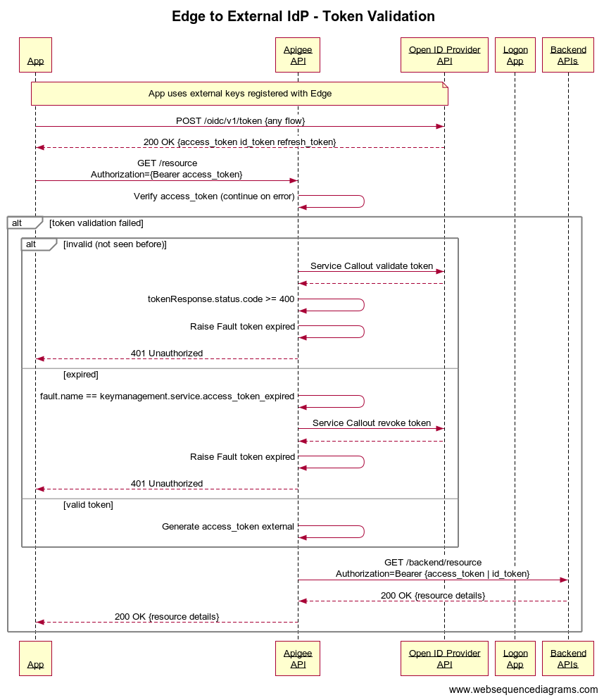

# External OAuth Token Validation

Example Shared Flow demonstrating how to use a Shared Flow to validate an external access token and use it as the value of the Apigee access_token.

## Mock External IdP (kurtkanaskietrainer-trial)
Uses an Edge proxy in a separate org to simulate the external IdP
* Proxy: Demo-ExternalOAuthTokenGeneration
* API Product: Demo-ExternalOAuthTokenGeneration
* App: Demo-ExternalOAuthTokenGeneration-test 
    * Has external_client_id attribute that is the client_id of the App in Host
    * This simulates synchronization between External IdP and APigee

## Host (amer-demo13)
The host uses an API Proxy to test the Shared Flow.
* Shared Flow: SF-ExternalOAuthTokenValidation
* Proxy: Demo-ExternalOAuthTokenValidation
* API Product: Demo-ExternalOAuthAccessToken-test
* App: Demo-ExternalOAuthAccessToken-test

## Sequence Diagram

## Disclaimer

This example is not an official Google product, nor is it part of an official Google product.

## License

This material is copyright 2019, Google LLC. and is licensed under the Apache 2.0 license.
See the [LICENSE](LICENSE) file.

This code is open source.